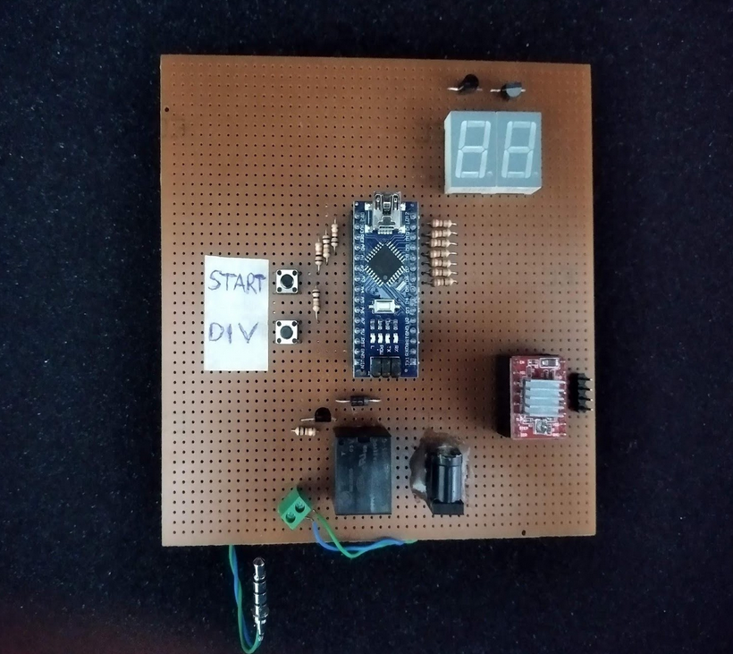
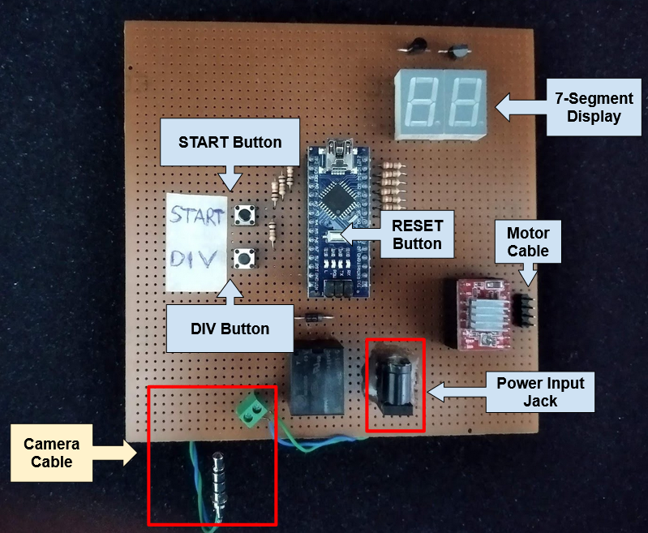

# 360 Product Photography

This file is the user guide of the product that allows it to take an optional number of photographs of the product on the 360 ​​degree rotating table. The picture of the product (excluding motor and table) is shown below.

## Product Usage
The names of the parts of the product are shown in the picture below. 

Follow the steps below to use the product.

- Connect the power cable, motor cable and camera cable and wait for 2 seconds. Note: The direction of the motor cable changes the direction of rotation of the motor.
- When the system is turned on, the pre-recorded DIV (how many pictures will be taken) number will appear on the 7-Segment Display.
- If desired, the DIV number can be changed by pressing the DIV button. DIVISION Numbers: 1, 2, 4, 5, 8, 10, 20, 40, 50.
- After setting the desired DIV number, the system is started by pressing the START button.

## Infinite Loop Mode
The product has an infinite loop mode. In this mode, the step motor runs continuously until it is stopped. To run in infinite mode, the following operations should be done;

- While the system is running, press the START button immediately after the DIV button and release the START button while the DIV button is pressed.
- Release the DIV button after the step motor has started.
- Press and release the START button to exit the endless loop mode.

## Product Settings
The settings made will remain saved in the system. Settings will remain saved even if the system is powered down.

### Camera Active Time Setting
Setting the time when the camera capture will be activated;

- While the system is running, press the START button and while holding the START button, press and release the RESET button.
- Wait until a number appears on the 7-Segment Display. When the number appears, release the START button. The number that appears on the display is the Active Time.
- Press and release the START button to increase the time. Hold to increase fast.
- When the desired time is reached, press and release the DIV button while the START button is not pressed.

### Camera Passive Time Setting
Setting when the camera's shooting will be passive;

- While the system is running, press the DIV button and while the DIV button is pressed, press and release the RESET button.
- Wait until a number appears on the 7-Segment Display. When the number comes out, release the DIV button. The number that appears on the display is Passive Time.
- Press and release the DIV button to increase the time. Hold to increase fast.
- When the desired time is reached, press and release the START button while the DIV button is not pressed.